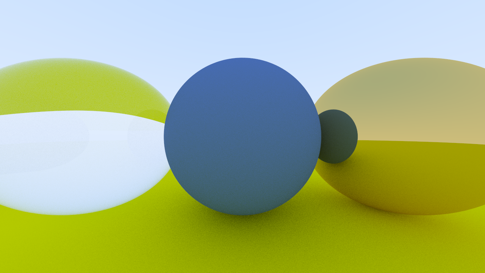
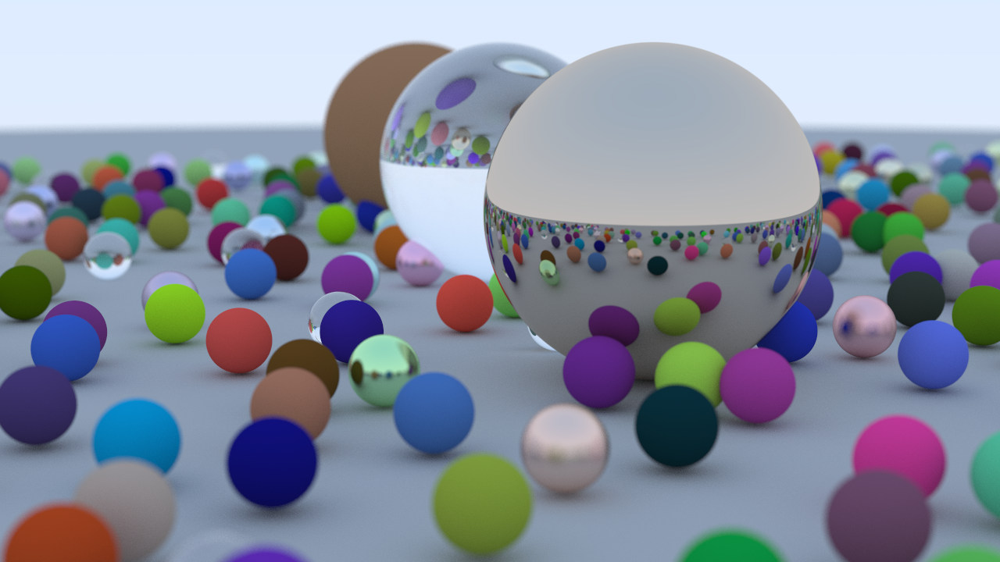

# Ray Tracing in One Weekend - C Implementation

This project is a C implementation of the [_Ray Tracing in One Weekend_](https://raytracing.github.io/books/RayTracingInOneWeekend.html) book by Peter Shirley. It aims to provide a simple and straightforward implementation of a ray tracer using C programming language. It outputs images in the ppm format. It's inefficient but easy to implement.


## Introduction

In this project, we explore the fundamentals of ray tracing and implement a basic ray tracer in C.  Ray tracing is a technique used in computer graphics to generate realistic images by simulating the behavior of light rays in a scene.

## Getting Started

**Prerequisites**
- Meson build system
- Ninja
- A C compiler

To get started with this project, follow these steps:

1. Clone the repository: 
```bash
git clone https://github.com/xAndreMCx/raytracing_in_a_weekend.git
```
2. Setup the build directory:
```bash
meson setup build
```
3. Build the project:
```bash
meson compile -C build
```
4. To run the executable:
```bash
./build/raytracer
```

## Usage

To use the ray tracer, you can modify the scene description in the code and adjust the rendering settings according to your preferences. You can also add new objects or materials to the scene to experiment with different effects.

## Examples

Here are some example images rendered using this ray tracer:






## Contributing

Contributions to this project are welcome. If you find any issues or have suggestions for improvements, please open an issue or submit a pull request.

## License

This project is licensed under the [MIT License](LICENSE).
